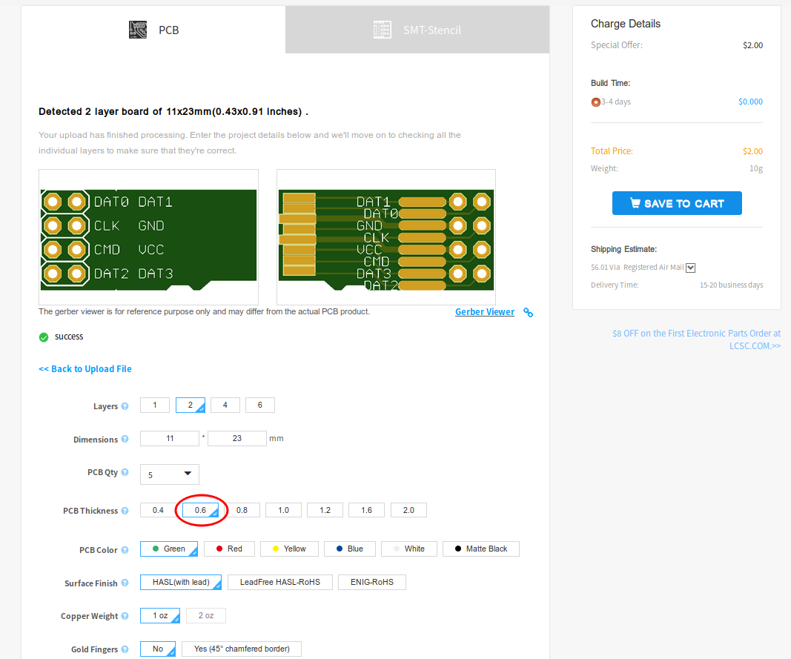

microSD male breakout board
=========================

based on

[*SparkFun microSD Sniffer (TOL-09419)*](https://www.sparkfun.com/products/9419)

https://github.com/sparkfun/MicroSD_Sniffer

Repository Contents
-------------------
* **/Hardware** - Eagle design files (.brd, .sch)

Manufacturing
-------------------
You can have it manufactured just by a few clicks and cheaply here: https://www.pcbway.com/project/shareproject/MicroSD_breakout_board.html

You will also support me by using this service.

Thanks!

Sample
-------------------

License Information
-------------------

This product is _**open source**_! 

Please review the LICENSE.md file for license information. 

If you have any questions or concerns on licensing, please contact github@danman.eu.

Distributed as-is; no warranty is given.
